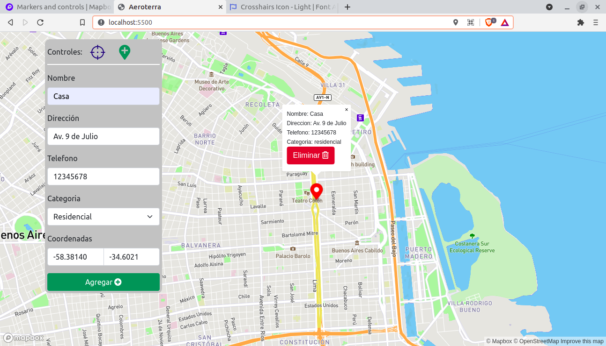

# Aeroterra Challenge

En el directorio del proyecto encontrarás 3 archivos nombrados:

## `index.html` - `style.css` - `main.js`

### Para iniciar puedes clonar este proyecto usando el comando `git clone`

Esta aplicación utiliza la API de Maxbox GL JS, para más información:\
[https://docs.mapbox.com/mapbox-gl-js/api/](https://docs.mapbox.com/mapbox-gl-js/api/) 

### Inicia la aplicación y abre tu navegador, una vez que estes ahí deberias ver algo similar a:

&nbsp;&nbsp;

### En el control con el icono de apuntar pódras obtener las coordenadas de tu posición actual:

&nbsp;&nbsp;

### En el control con el icono de marcador pódras abrir el formulario de creación de nuevos marcadores en el mapa:

&nbsp;&nbsp;

